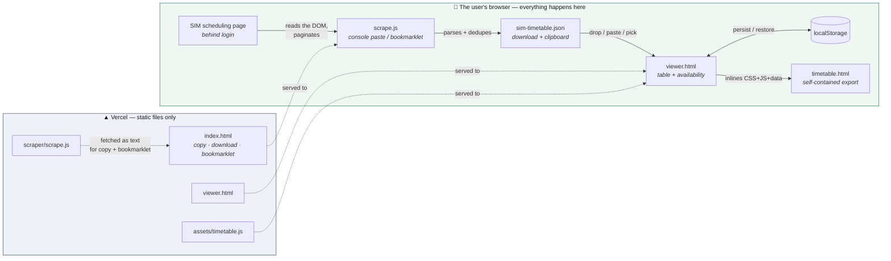

# Architecture

**Live:** https://sim-timetable.vercel.app · **Repo:** https://github.com/Cetus024/sim-timetable

For *why* it is shaped this way, see [docs/PRD.md](docs/PRD.md) §5.
For implementation depth — data contracts, algorithms, failure modes — see
[docs/TECHNICAL-DESIGN.md](docs/TECHNICAL-DESIGN.md).

---

## The one-sentence version

A static site hands you a scraper, you run it inside your own logged-in browser tab, and it hands
you back a JSON file that the same static site renders locally — so the schedule data never
crosses a network boundary.

## System diagram



**The dotted arrows are the only network traffic**, and they are all static asset fetches. No
schedule data ever travels along them. There is no request path from the user's data to any
server — not to Vercel, not anywhere. That is the single most important property of this design.

## Trust boundary

```
   authenticated ──┐
   SIM session     │   ← the scraper lives INSIDE this boundary, because
                   │      nothing outside it can see the schedule at all
   ────────────────┼────────────────────────────────────────────────
                   │
   Vercel          │   ← serves inert text files; receives nothing back
```

A server-side scraper would require holding the user's SIM credentials. Refusing to build one is
what keeps this project free of any credential surface at all.

## Components

| Path | Runs where | Responsibility | Talks to |
| --- | --- | --- | --- |
| `scraper/scrape.js` | the SIM page, via console/bookmarklet | Paginate, extract, verify coverage, parse, emit JSON | The page DOM only |
| `index.html` | Vercel → browser | Deliver the scraper three ways; explain the flow | Fetches `scrape.js` as text |
| `viewer.html` | Vercel → browser | Import, persist, export; owns page chrome | Fetches assets; reads files |
| `assets/timetable.js` | browser | **All** parsing + rendering logic | Nothing — pure, no I/O |
| `assets/styles.css` | browser | Shared styling, light + dark | — |
| `scripts/serve.mjs` | local dev only | Static server mirroring Vercel's clean URLs | — |
| `scripts/auto-scrape.mjs` | your machine, nightly | Headless scrape via a saved profile; publishes `data/latest.json` | The schedule page; git |
| `vercel.json` | Vercel edge | Clean URLs, content types, no-cache on the scraper | — |

## Two structural decisions

**1. `assets/timetable.js` is the single renderer, and it does no I/O.**

It is `mount(element, rows, options)` and nothing else — no fetch, no storage, no globals beyond
one namespace. The viewer owns all I/O and hands it data.

This is what makes the standalone export honest rather than a second implementation: the export
fetches this exact file's source, inlines it, and calls the same `mount()`. The exported file and
the live viewer cannot drift, because there is only one renderer. A bug fixed in one is fixed in
both.

**2. The landing page never hardcodes the scraper source.**

It fetches `/scraper/scrape.js` at runtime and uses that one string for both the visible code
block and the bookmarklet's `javascript:` URL. Same reasoning: the code you read, the code you
copy, and the code the bookmarklet runs are guaranteed to be the same bytes.

## Data flow

```
SIM DOM rows          {time, event, building, room, status}       — strings, as displayed
      │  scrape.js: parseTimeRange / parseBlock / parseFloor
      ▼
parsed rows           {start, end, start_min, end_min, block, floor, room, event, status}
      │  wrapped with provenance
      ▼
payload               {version, source, scraped_at, site_total, incomplete, rows[]}
      │  viewer.coerce() — also accepts a bare array, back-fills from raw fields
      ▼
SIMTimetable.mount()  → filter → { table view | availability timeline }
```

`start_min` / `end_min` are minutes since midnight. Every comparison — sorting, gap detection,
the free-after/before filters — runs on those integers; the `"4:00 PM"` strings are only ever for
display. Parsing happens once, at scrape time.

## Why no framework, no build step

The whole app is ~900 lines of vanilla JS and CSS with zero dependencies, deployed as raw files.

- Nothing to reinstall or re-audit when picking this up in a year.
- No supply chain — nothing third-party executes in a tab that has the user's SIM session open.
- The standalone export stays small (~21KB) and works from `file://` forever.
- Deploy is a file copy; there is no build that can break.

The tradeoff is manual DOM work in the renderer, which is acceptable at this size and is confined
to one file.

## Deployment

Static files, no build command, deployed from the CLI:

```bash
vercel deploy --prod --yes
```

> **Note:** the Vercel project is **not** connected to GitHub, so `git push` does **not** deploy.
> Pushing and deploying are two separate steps. See
> [docs/TECHNICAL-DESIGN.md](docs/TECHNICAL-DESIGN.md) §9 for the local Vercel CLI quirk on the
> author's machine.
